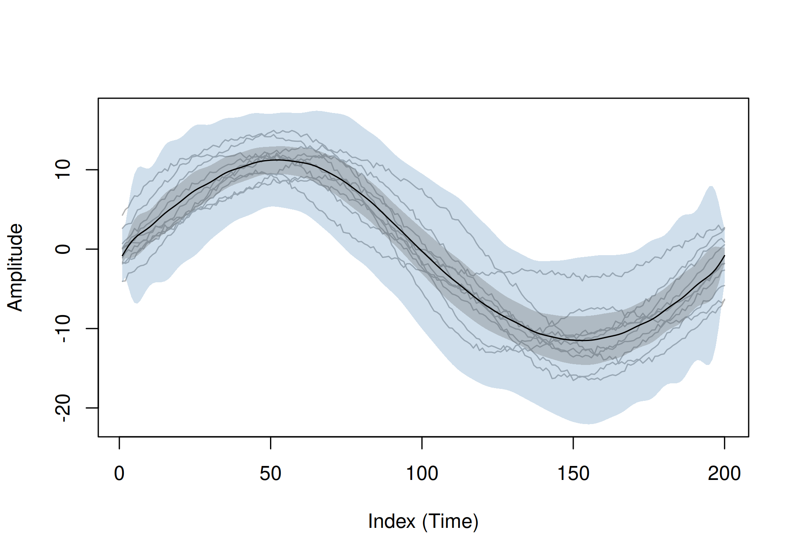
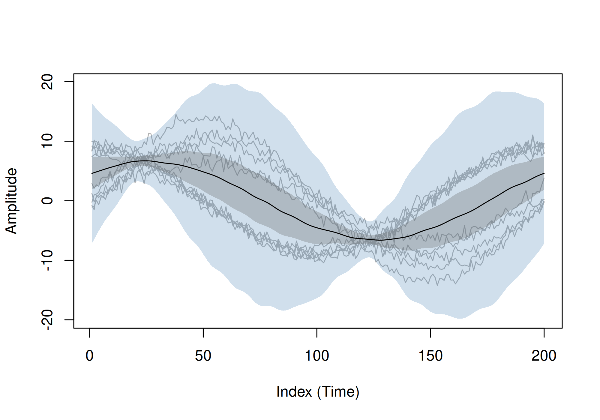

# funbootband

<!-- badges: start -->
[](https://github.com/koda86/funbootband-cran/actions/workflows/R-CMD-check.yaml)
[](https://app.codecov.io/gh/koda86/funbootband-cran)
<!-- badges: end -->

`funbootband` computes **simultaneous prediction and confidence bands** for dense time series data (e.g., gait curves sampled on a common grid). It accepts ordinary
matrix/array inputs and internally maps them to a smooth functional representation (finite Fourier basis by default) for calibration. It supports i.i.d. and **clustered** (hierarchical) designs and uses a fast **Rcpp** backend
for the bootstrap.

## Installation


The stable release is available on CRAN:

```r
install.packages("funbootband")
```

You can install the development version of funbootband from [GitHub](https://github.com/) with:

``` r
# install.packages("pak")
pak::pak("koda86/funbootband-cran")
```

## Example

### i.i.d. example with smooth simulated curves

Below we simulate smooth time-series data from a Gaussian-process model and compute both
**simultaneous prediction** and **confidence bands**:

``` r
library(funbootband)

set.seed(1)
T <- 200; n <- 10
x <- seq(0, 1, length.out = T)

# simulate smooth Gaussian-process-like curves
mu  <- 10 * sin(2 * pi * x)
ell <- 0.12; sig <- 3
Kmat <- outer(x, x, function(s, t) sig^2 * exp(-(s - t)^2 / (2 * ell^2)))
ev <- eigen(Kmat + 1e-8 * diag(T), symmetric = TRUE)
Z  <- matrix(rnorm(T * n), T, n)
Y  <- mu + ev$vectors %*% (sqrt(pmax(ev$values, 0)) * Z)
Y  <- Y + matrix(rnorm(T * n, sd = 0.2), T, n)

fit_pred <- band(Y, type = "prediction", alpha = 0.11, iid = TRUE, B = 1000L, k.coef = 50L)
fit_conf <- band(Y, type = "confidence", alpha = 0.11, iid = TRUE, B = 1000L, k.coef = 50L)
```



### Clustered example with smooth simulated curves

This example illustrates the use of `band()` for **clustered time-series data**, where
each group (cluster) has its own mean pattern and within-cluster variation.

``` r
library(funbootband)

set.seed(2)
T <- 200
m <- c(5, 5)
x <- seq(0, 1, length.out = T)

# cluster-specific means
mu <- list(
  function(z) 8 * sin(2 * pi * z),
  function(z) 8 * cos(2 * pi * z)
)

# smooth within-cluster variation
Bm <- cbind(sin(2 * pi * x), cos(2 * pi * x))
gen_curve <- function(k) {
  sc <- rnorm(ncol(Bm), sd = c(2.0, 1.5))
  mu[[k]](x) + as.vector(Bm %*% sc)
}

Ylist <- lapply(seq_along(m), function(k) {
  sapply(seq_len(m[k]), function(i) gen_curve(k) + rnorm(T, sd = 0.6))
})
Y <- do.call(cbind, Ylist)
colnames(Y) <- unlist(mapply(
  function(k, mk) paste0("C", k, "_", seq_len(mk)),
  seq_along(m), m
))

fit_pred <- band(Y, type = "prediction", alpha = 0.11, iid = FALSE, B = 1000L, k.coef = 50L)
fit_conf <- band(Y, type = "confidence", alpha = 0.11, iid = FALSE, B = 1000L, k.coef = 50L)
```



## References
- Lenhoff et al. (1999) <doi:10.1016/S0966-6362(98)00043-5>  
- Koska et al. (2023) <doi:10.1016/j.jbiomech.2023.111506>
